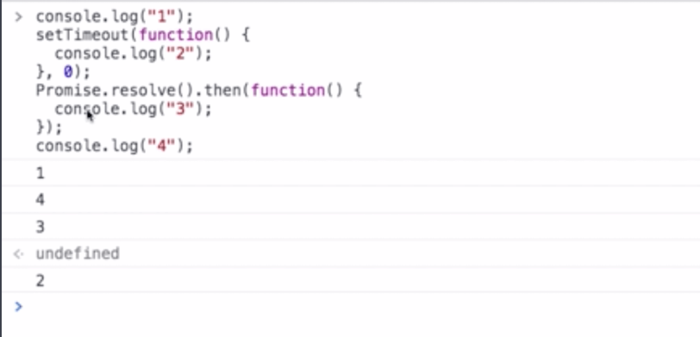
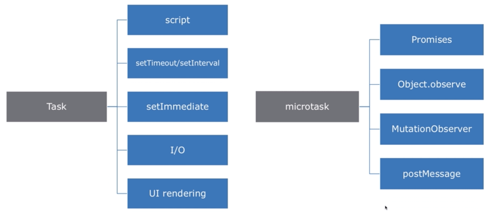
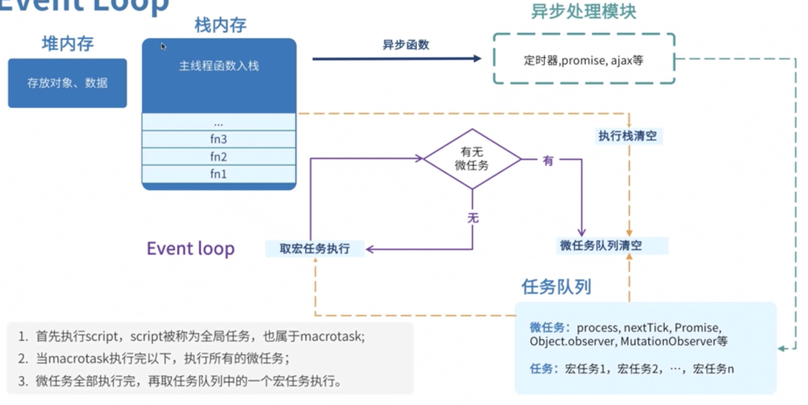
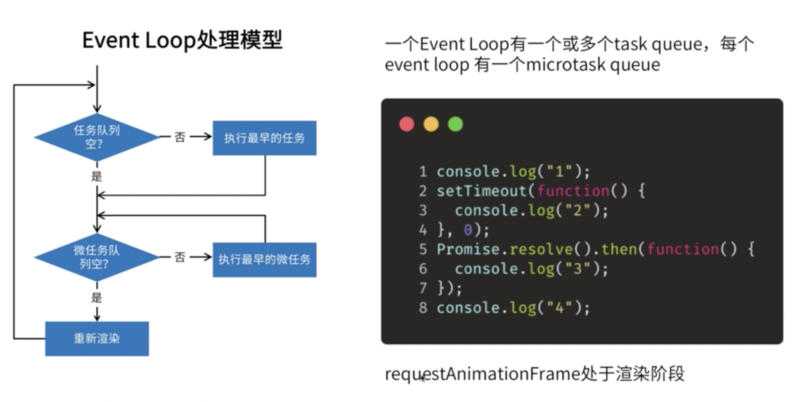

# Event Loop 机制

以前 js 是在浏览器环境中运行，由于 chrome 对 v8 做了开源；所以 js 有机会在服务端运行；浏览器和 node 都是 js 的运行环境，它们相当于是一个宿主，宿主能提供一个能力能帮助 js 实现 Event Loop

#### js 单线程问题

所有任务都在一个线程上完成，一旦遇到大量任务或遇到一个耗时的任务，网页就可能出现假死，也无法响应用户的行为

#### Event Loop 是什么

Event Loop 是一个程序结构，用于等待和发送信息的事件。 简单说就是在程序中设置 2 个线程，一个负责程序本身的运行，称为“主线程”；另一个负责主线程和其他进程（主要是各种 I/O 操作）的通信 被称为“Event Loop 线程”（也可以翻译为消息线层）

js 就是采用了这种机制，来解决单线程带来的问题。

## 浏览器的 Event Loop

#### 异步实现

1. 宏观：浏览器多线程（从宏观来看是多线程实现了异步）
2. 微观：Event Loop，事件循环（Event Loop 翻译是事件循环，是实现异步的一种机制）

#### 先看一个例子

```js
console.log(1);
setTimeout(function () {
  console.log(2);
}, 0);
Promise.resolve().then(function () {
  console.log(3);
});
console.log(4);
// 1 4 3 2
```


1 和 4 是同步任务肯定是最先执行，现在要看异步任务，现在要看的是 promise 的回调为什么在定时器前面执行，那为什么 promise 后放入，为什么先执行呢？那是因为 Event Loop 的机制是有微任务的说法的；现在往下看。

#### 宏任务（普通任务）和微任务



`宏任务（task）：`

1. script：script 整体代码
2. setImmediate：node 的一个方法
3. setTimeout 和 setInterval
4. requestAnimationFrame
5. I/O
6. UI rendering
   ...

`微任务（microtask）：`

1. Object.observe:监听对象变化的一个方法
2. MutationObserver:可以监听 Dom 结构变化的一个 api
3. postMessgae:window 对象通信的一个方法
4. Promise.then catch finally

#### Event Loop 的运行过程


线程都有自己的数据存储空间，上图可以看见堆和栈，堆的空间比较大，所以存储一些对象；栈的空间比较小， 所以存储一些基础数据类型、对象的引用、函数的调用；函数调用就入栈，执行完函数体里的代码就自动从栈中移除这个函数，这就是我们所说的调用栈； 栈是一个先进后出的数据结构，当最里面的函数出栈的时候，这个栈就空了；当我们调用时候会调用一些异步函数， 这个异步函数会找他们的异步处理模块，这个异步模块包括定时器、promise、ajax 等，异步处理模块会找它们各自 对应的线程，线程向任务队列中添加事件，看我们的蓝色箭头，表示在任务队列中添加事件，橘色的箭头是从任务队列中取事件，取出这个事件去执行对应的回调函数；

::: tip 有 3 个点要注意

1. 我们整个大的 script 的执行是全局任务也是一个宏任务的范畴，
2. 当宏任务执行完，会去执行所有的微任务，
3. 微任务全部执行完在去执行下一个宏任务，那什么时候去执行一个微任务呢，是等调用栈为空的时候，调用栈不为空的时候，任务队列的微任务一直等待；微任务执行完又去取任务队列里的. 宏任务，去依次 执行宏任务，执行宏任务的时候就要检查当前有没有微任务，如果有微任务就去执行完所有微任务，然后 再去执行后续的宏任务

:::

#### 代码示例 1



`执行步骤：`

1. 大的 script 是个宏任务，检查任务队列是否为空，当前不为空，然后执行 1 和 8 行代码；那么打印出了 1 和 4
2. 执行完 1 和 8 行代码后去检查微任务队列，微任务队列不为空，执行了 Promise 的回调，此时打印出了 3
3. 执行完 Promise 的回调后，在检查微任务队列，现在微任务队列为空，进行重新渲染一便
4. 在去检查任务队列，现在任务队列中有了定时器的事件，又打印出了 2

`注意点：`

1. 一个 Event Loop 有一个或多个 task queue（任务队列）
2. 每个个 Event Loop 有一个 microtask queue（微任务队列）
3. requestAnimationFrame 不在任务队列也不在为任务队列，是在渲染阶段执行的
4. 任务需要多次事件循环才能执行完，微任务是一次性执行完的
5. 主程序和和 settimeout 都是宏任务，一个 promise 是微任务，第一个宏任务（主程序）执行完，执行全部的微任务（一个 promise），再执行下一个宏任务（settimeout）

#### 代码示例 2

```js
console.log("start");

setTimeout(() => {
  console.log("setTimeout");
  new Promise((resolve) => {
    console.log("promise inner1");
    resolve();
  }).then(() => {
    console.log("promise then1");
  });
}, 0);

new Promise((resolve) => {
  console.log("promise inner2"); //同步执行的
  resolve();
}).then(() => {
  console.log("promise then2");
});
// 打应结果
/*
start
promise inner2
promise then2
setTimeout
promise inner1
promise then1
*/
```

#### 代码示例 3

```js
async function async1() {
  console.log("async1 start");
  await async2();
  console.log("async1 end");
}

async function async2() {
  return Promise.resolve().then((_) => {
    console.log("async2 promise");
  });
}

console.log("start");
setTimeout(function () {
  console.log("setTimeout");
}, 0);

async1();

new Promise(function (resolve) {
  console.log("promise1");
  resolve();
}).then(function () {
  console.log("promise2");
});

/**
 * start
 * async1 start
 * promise1
 * async2 promise
 * promise2
 * async1 end
 * setTimeout
 */
```

`执行步骤：`

1. 先执行主线程的同步任务（也是宏任务), 先执行`start`然后遇到了 setTimeout，把它放到下一次宏任务中执行，我们叫它宏 2；然后调用 async1()函数，执行了`async1 start`；又调用了 async2 函数执行 Promise.resolve().then；由于 then 的回调函数是微任务，就把它放到微任务队列中，我们叫它微 1；遇见 await 是等待的意思，需要把第一轮的微任务执行完，在执行 await 下面的内容，我们在执行 new Promise(),打印了`promise1`,又调用了 resolve()改变了 promise 状态，这个 then 的回调我们叫它微 2；第一轮宏任务执行完毕。

2. 第一轮宏热任务执行完毕后，我们检查微任务队列中的微任务，把它全部执行完，就打印了`async2 promise、promise2`

3. 第一轮微任务执行完，就执行 await 后面的内容`async1 end`

4. await 后面的内容执行完后又执行宏任务`setTimeout`

#### 代码示例 4

```js
setTimeout(() => {
  console.log(1);
  new Promise((r) => {
    r();
  }).then((res) => {
    console.log(2);
    Promise.resolve().then(() => {
      console.log(3);
    });
  });
});
setTimeout(() => {
  console.log(4);
  new Promise((r) => {
    r(1);
  }).then((res) => {
    console.log(5);
  });
});
/**
 * 1
 * 2
 * 3
 * 4
 * 5
 */
```

1. 先执行 script 代码，遇到第一个 setTimeout，放到宏任务队列中我们叫它宏 1，遇到第二个 setTimeout，放到宏任务队列中我们叫它宏 2。
2. 检查微任务队列中有无任务，有就全部执行，本次宏任务下没有产生微任务，没有就拿出宏 1 进行执行，执行宏 1 打印 1；然后遇到 promise 就把 then 的回调放到微任务队列；宏 1 执行完以后，就去检查微任务队列中有任务么，有就全部执行，所以我们就执行了 2，在 then 的回调中又产生了微任务，所以我们又执行了 3，记住一点，要把本次宏任务下所产生的微任务全部执行完才会执行下一个宏任务，记住是产生的，没有产生的不会执行。
3. 一轮宏任务执行完以后，再去执行下一个宏任务，就会去执行宏 2，就打印了 4，在检查有没有产生了微任务，如果微任务队列中有微任务就全部执行，有微任务所以打印了 5。
