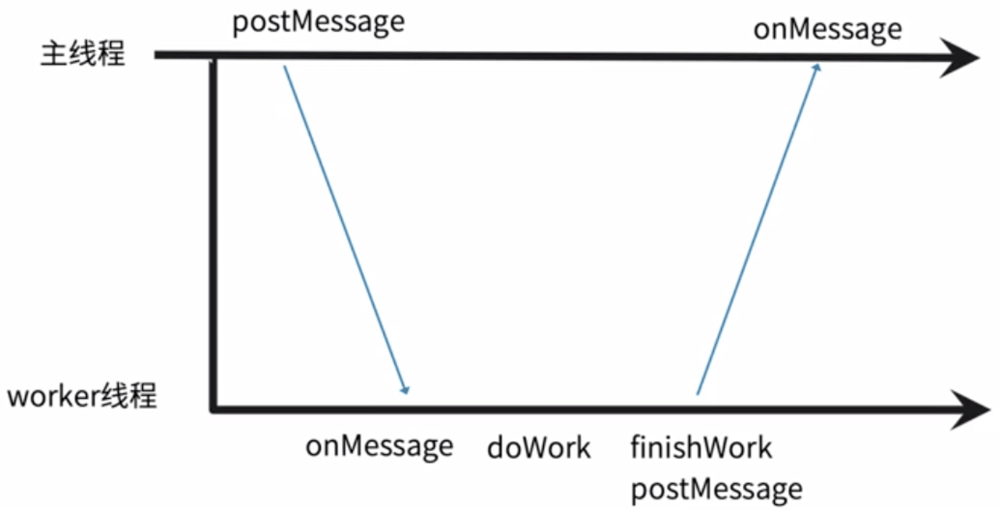
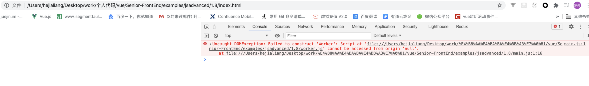

# Web Workers 的多线程机制

## Web Workers 介绍

- 一个 Web API-> 浏览器能力 -> 提供一个 js 可以运行的环境
- Web 应用程序可以在独立于主线层的后台线程中，运行一个脚本操作
- 关键点：性能考虑

web Workers 主要处理一些耗时的任务，比如一家公司老板忙不来，肯定会招一些人，这些会承担一些公司的脏活累活，占用时间比较多的活，老板只做一些核心的事情。所以 web worker 是来分担主线程的负担的，所以 web worker 的意义在于一些耗时的任务从主线层剥离出来，让 worker 做这些耗时的处理； 那么主线程专注于页面的渲染和交互，那么我们访问的页面的性能会更好。

#### worker 的主要方法

- onerror、onmessage、onmessageerror、postMessage、importScripts、close

#### worker 线程和主线程的通信



我们知道 worker 是一个线程，那么主线程指派任务给 worker 线程是怎样通信的呢？就设计到 2 个线程之间的通信。

主线程有一个 postMessage 方法用来通知 worker 线程任务，worker 有一个 onMessage 的方法用来接收主线程的任务，接收到主线程的消息之后就去工作，工作完之后 worker 也有一个 postMessage 方法用来通知主线程干完了；主线程也有一个 onMessage 方法，能获取到 worker 的工作已经做完了，以及结果是什么。

## 实战一个 web worker 的案例

这个案例是我们把耗时的斐波那契数列放到 worker 里计算

1. index.html

```js
<!DOCTYPE html>
<html lang="en">
  <head>
    <meta charset="UTF-8" />
    <meta http-equiv="X-UA-Compatible" content="IE=edge" />
    <meta name="viewport" content="width=device-width, initial-scale=1.0" />
    <title>Document</title>
  </head>
  <body>
    <script src="./main.js"></script>
  </body>
</html>
```

2. main.js

```js
//  new Worker 之后，worker进行工作
const worker = new Worker("worker.js");

worker.onmessage = function (e) {
  console.log("拿到worker通知的数据", e);
  worker.postMessage("message收到了");
};
```

3. worker.js
   worker 线程去计算斐波那契数列

```js
unction fibonacci(n) {
  if (n === 1 || n == 2) {
    return 1
  }
  return fibonacci(n - 2) + fibonacci(n - 1)
}
// 告诉主线程
postMessage(fibonacci(40))

// 收到主线程的消息
onmessage = function(e) {
  console.log('好的，拿到了就好', e)
}
```

#### 当你点开 index.html 会出现报错



这个报错是什么原因呢？

因为我们用 worker 是限制的，不是本地跑一个 html 就行，new Worker("worker.js")里的参数不能通过本地路径去取的，不支持 file 协议；需要起一个静态资源服务，我们可以用 browser-sync。

```sh
npm install -g browser-sync # 下载

-browser-sync start --server # 启动，注意启动服务要在index.html这个文件夹
```

xw 启动完之后，访问 http://localhost:3000/index.html

源代码地址：Senior-FrontEnd/examples/jsadvanced/3.8/

### 3.8.3 worker 的能力是受限制的

#### 预习资料

|       预习资料名称        |                               链接                                |             备注              |
| :-----------------------: | :---------------------------------------------------------------: | :---------------------------: |
|       Blob 对象用法       | [阅读地址](https://developer.mozilla.org/zh-CN/docs/Web/API/Blob) | 嵌入式 webworkers 会用到 Blob |
| JavaScript 中的 Blob 对象 |   [阅读地址](https://juejin.im/entry/5937c98eac502e0068cf31ae)    |   掘金上比较基础的一篇文章    |

- 与主线程脚本同源

  在主线程下运行的 worker 必须与主线程同源

- 与主线程上下文不同

  - 在 worker 下无法操作 dom，可以操作 Navigator、location 等，就是不会引起页面混乱的可以用。
  - 不能执行 alert 等

- 不能读取本地文件
  - 所有加载的文件来源于网络，不来来源于 file 协议。

可以在 worker.js 下打印 this 看一下它的全局对象

#### 嵌入式 worker

我们刚刚了解到，`new Worker(woker路径)`里的路径不能去从本地读取的，但是我们现在很多都是模块的写法，很多都会用到`require.js`,那么有没有简单的方法在项目中使用 workers 呢？看下面案例。

```html
<!DOCTYPE html>
<html lang="en">
  <head>
    <meta charset="UTF-8" />
    <meta http-equiv="X-UA-Compatible" content="IE=edge" />
    <meta name="viewport" content="width=device-width, initial-scale=1.0" />
    <title>Document</title>
  </head>
  <body>
    <!-- type="javascript/worker" 写上这个类型，里面的脚本是不会执行的 -->
    <script type="javascript/worker" id="worker">
      function fibonacci (n) {
            if(n===1 || n ==2) {
                return 1
            }
            return fibonacci(n-2) + fibonacci(n-1)
        }

        postMessage(fibonacci(40))
    </script>
    <script>
      // 拿到worker里的代码字符串
      var workerScript = document.querySelector("#worker").textContent;
      // Blob ：二进制大对象
      var blob = new Blob([workerScript], { type: "text/javascript" });
      // blob:null/9d8594c9-1783-46f9-8001-c6112af6a15a 可以在浏览器中访问，可以看见worker里的代码
      var worker = new Worker(window.URL.createObjectURL(blob));
      worker.onmessage = function (e) {
        console.log("拿到worker通知的数据", e);
        worker.postMessage("message收到了");
      };
    </script>
  </body>
</html>
```

#### webworkify

如果按照上面的写法，在 2 个 script 标签里面写，显得不是很优雅；于是前辈给我们封装了`webworkify`,它也是利用`blob`、`createObjectURL`。

### Web Worker 的使用场景

- 解决的痛点
  - js 执行复杂运算时阻塞了页面渲染
- 使用场景
  - 复杂运算
  - 渲染优化（canvas 有个离线的 api 结合 worker）
  - 流媒体数据处理

#### 哪些项目中用到了 Web worker？

- flv.js
  用 h5 的标签去播放 flv 格式的视频，用于直播、录播，它去解码 http-flv 格式的视频，通过 Media SourceExtensions,解码的过程就是在 workers 里执行的。

了解 SharedWorker 和 ServiceWOrker（pwa 的基础，可以做页面的缓存优化）
