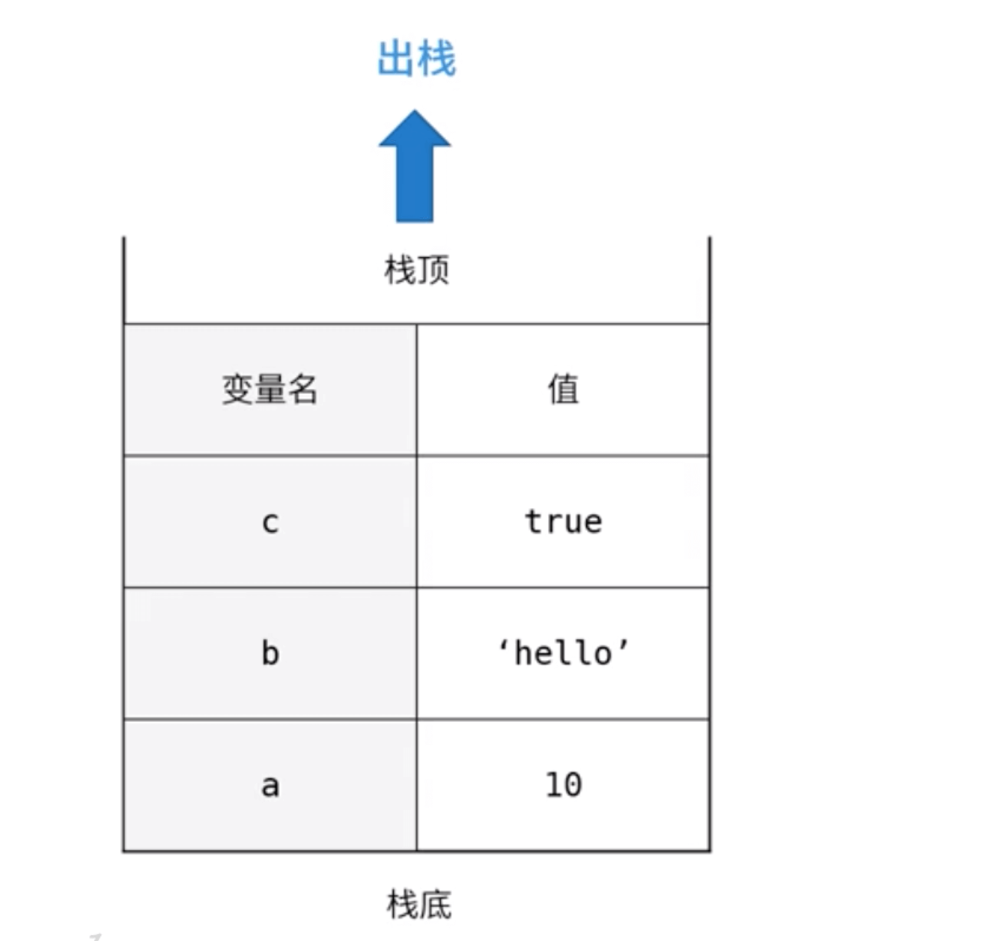
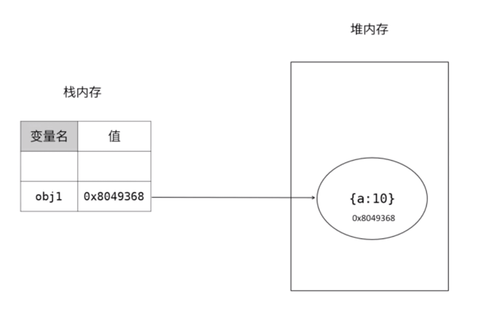

# javaScript 内存管理

## js 内存机制

#### 内存空间：栈内存（stack）、堆内存（heap）

1. 栈内存：所有原始数据类型都存储在栈内存中，如果删除一个栈原始数据，遵循先进后出；如下图：a 最先进栈，最后出栈。
   

2. 堆内存：引用数据类型会在堆内存中开辟一个空间，并且会有一个十六进制的内存地址，在栈内存中声明的变量的值就是十六进制的内存地址。
   

- **垃圾回收**

  #### 概念

  所谓的垃圾回收就是找出那些不再继续使用的变量，然后释放出其所占用的内存，垃圾回收会按照固定的时间间隔周期性的执行这一操作。

  #### javaScript 使用的垃圾回收机制来自动管理内存，垃圾回收是把双刃剑；垃圾回收是不可见的

  - **优势：** 可以大幅简化程序的内存管理代码，降低程序员的负担，减少因长时间运转而带来的内存泄漏问题。

  - **不足** 程序员无法掌控内存，javascript 没有暴露任何关于内存的 api，无法强迫进行垃圾回收，无法干预内存管理。

## 垃圾回收的方式

1.引用计数（reference counting）

跟踪记录每个值被引用的次数，如果一个值引用次数是 0，就表示这个值不再用到了，因此可以将这块内存释放

原理：每次引用加 1，被释放减 1，当这个值的引用次数变成 0 时，就将其内存空间释放。

```js
let obj = { a: 10 }; // 引用+1
let obj1 = { a: 10 }; // 引用+1
obj = {}; //引用减1
obj1 = null; //引用为0
```

引用计数的 bug：循环引用

```js
// ie8较早的浏览器,现在浏览器不会出现这个问题
function Fn() {
  var objA = { a: 10 };
  var objB = { b: 10 };
  objA.c = objB;
  objB.c = objA;
}
```

2.标记清除（现代浏览采用标记清除的方式）

在运行的时候给存储在内存中所有变量加上标记; 从根部出发，能触及到的对象，把标记清除; 剩余那些有标记的就被视为将要删除的变量;
