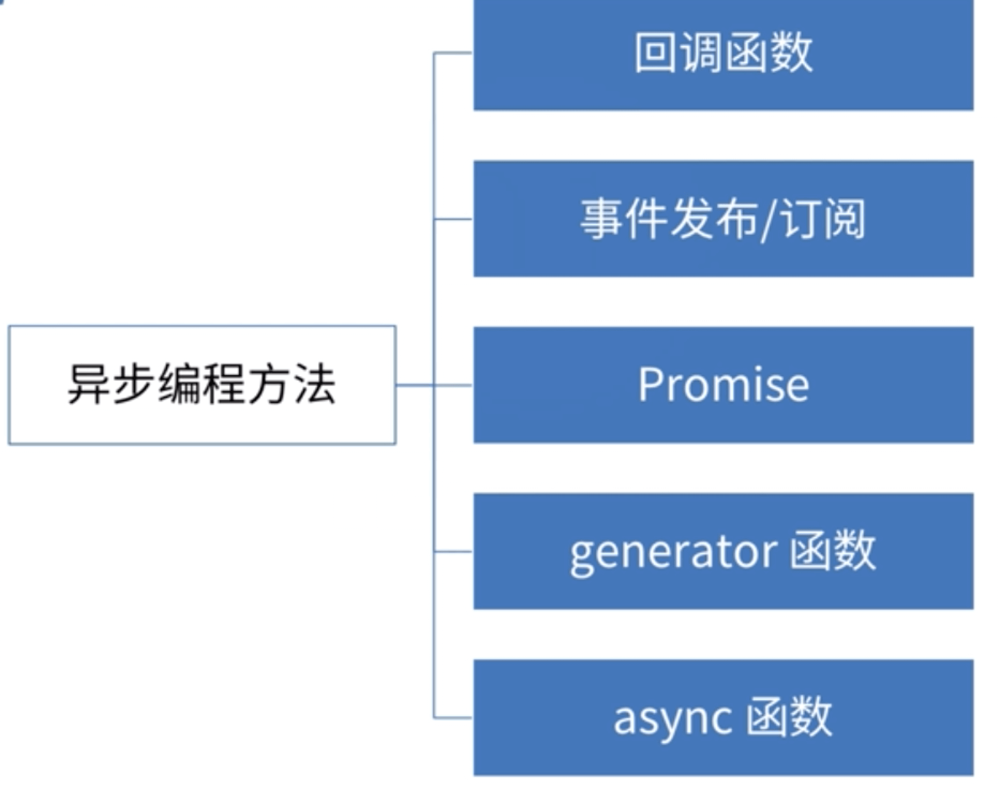
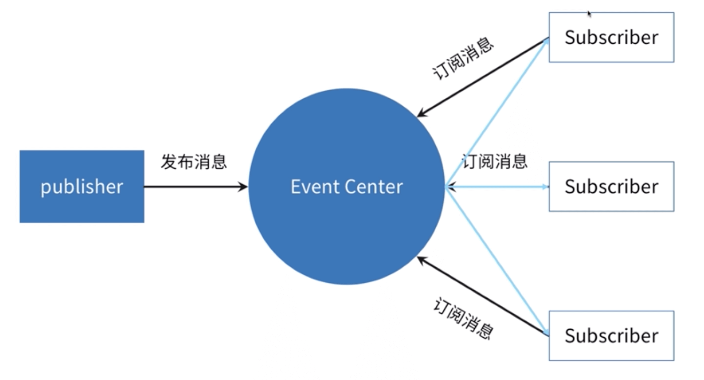

# 异步编程方法-发布订阅

## 理解发布/订阅

#### 异步编程的几种方式



#### 回调的形式实现请求

```js
function ajax(url, callback) {
  // 实现省略
}
ajax("./test1.json", function (data) {
  console.log(data);
  ajax("./test2.json", function (data) {
    console.log(data);
    ajax("./test3.json", function (data) {
      console.log(data);
    });
  });
});
```

#### 发布订阅的形式

```js
// 发布订阅应用
function ajax(url, callback) {
  // 实现省略
}

const pbb = new PubSub();
ajax("./test1.json", function (data) {
  pbb.publish("test1Success", data);
});
pbb.subscribe("test1Success", function (data) {
  console.log(data);
  ajax("./test2.json", function (data) {
    pbb.publish("test2Success", data);
  });
});
pbb.subscribe("test2Success", function (data) {
  console.log(data);
  ajax("./test3.json", function (data) {
    pbb.publish("test3Success", data);
  });
});
pbb.subscribe("test2Success", function (data) {
  console.log(data);
});
```

- 我们通过 pbb.publish 这个方法发布 test1Success 这个事件
- 然后去订阅这个事件

#### 发布和订阅图例



## 实现事件发布/订阅

```js
class PubSub {
  constructor() {
    this.events = {};
  }
  // 发出一个事件
  publish(eventName, data) {
    if (this.events[eventName]) {
      this.events[eventName].forEach((cb) => {
        cb.apply(this, data);
      });
    }
  }
  // 订阅一个事件
  subscribe(eventName, callback) {
    if (this.events[eventName]) {
      this.events[eventName].push(callback);
    } else {
      this.events[eventName] = [callback];
    }
  }
  // 取消一个事件
  unSubcribe(eventName, callback) {
    if (this.events[eventName]) {
      this.events[eventName] = this.events[eventName].filter(
        (cb) => cb !== callback
      );
    }
  }
}
```

#### 发布和订阅的优缺点

优点

- 松耦合
- 灵活（多次去订阅一个事件） 缺点
- 无法确保消息被触发或者触发几次
