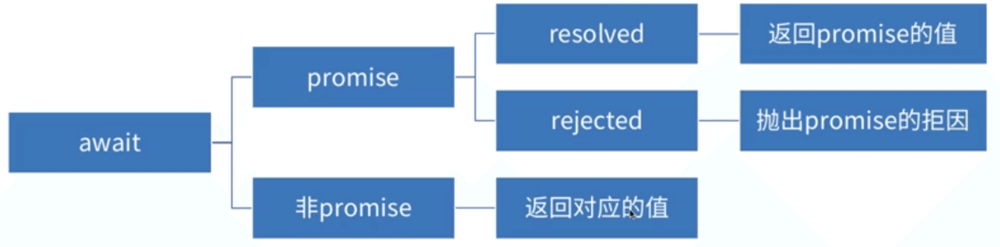

# 深入理解 async/await

## async 函数

- 一个语法糖 是异步操作更简单
- 返回值 返回值是一个 promise 对象
  - return 的值是 promise resolved 时候的 value
  - Throw 的值是 Promise rejected 时候的 reason

```js
async function test() {
  return 1;
}
const p = test();
console.log(p); // 打印出一个promise，状态是resolved，value是1
p.then(function (data) {
  console.log(data); //1
});
```

```js
async function test() {
  throw new Error("error");
}
const p = test();
console.log(p); // 打印出一个promise，状态是rejected，value是error
p.then(function (data) {
  console.log(data); //打印出的promise的reason 是error
});
```

可以看出 async 函数的返回值是一个 promise

## await

- 只能出现在 async 函数内部或最外层
- 等待一个 promise 对象的值
- await 的 promise 的状态为 rejected，后续执行中断

await 可以 await promise 和非 promsie，如果非 primse，例如：await 1 就返回 1



await 为等待 promise 的状态是 resolved 的情况

```js
async function async1() {
  console.log("async1 start");
  await async2(); // await为等待promise的状态，然后把值拿到
  console.log("async1 end");
}
async function async2() {
  return Promsie.resolve().then((_) => {
    console.log("async2 promise");
  });
}
async1();
/*
    打印结果
    async1 start
    async2 promise
    async1 end
  */
```

await 为等待 promise 的状态是 rejected 的情况

```js
async function f() {
  await Promise.reject("error");
  //后续代码不会执行
  console.log(1);
  await 100;
}

// 解决方案1
async function f() {
  await Promise.reject("error").catch((err) => {
    // 异常处理
  });
  console.log(1);
  await 100;
}

// 解决方案2
async function f() {
  try {
    await Promise.reject("error");
  } catch (e) {
    // 异常处理
  } finally {
  }
  console.log(1);
  await 100;
}
```

## async 函数实现原理

实现原理：Generator+自动执行器

async 函数是 Generator 和 Promise 的语法糖

## 应用

#### 用 async 函数方案读取文件

```js
async function readFilesByAsync() {
  const fs = require("fs");
  const files = [
    "/Users/kitty/testgenerator/1.json",
    "/Users/kitty/testgenerator/2.json",
    "/Users/kitty/testgenerator/3.json",
  ];
  const readFile = function (src) {
    return new Promise((resolve, reject) => {
      fs.readFile(src, (err, data) => {
        if (err) reject(err);
        resolve(data);
      });
    });
  };

  const str0 = await readFile(files[0]);
  console.log(str0.toString());
  const str1 = await readFile(files[1]);
  console.log(str1.toString());
  const str2 = await readFile(files[2]);
  console.log(str2.toString());
}
```
