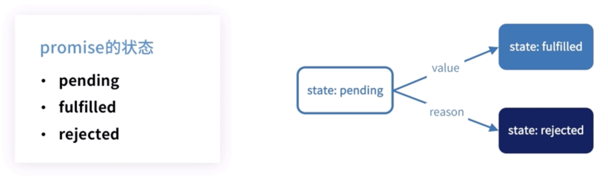

# 深入理解 promise

因为 es6 的 promise 是按照 A+规范来写的，如果我们想要理解 promise 源码，需要先看 A+规范

## promise A+规范

- promise 一个有 then 方法的对象或函数，其行为符合本规范
- thenable 一个定义了 then 方法的对象或函数
- value（值） 任何 javaScript 的合法值（包括 undefined,thenable 或 promise）
- exception（异常） throw 语句抛出的值
- reason（拒绝原因） 表示 promise 被拒绝原因的值

#### promise 的状态



pending：等待,可以转换成 fulfilled 或 rejected 状态

fulfilled：完成，拥有一个不可变的终值

rejected：拒绝，拥有一个不可变的据因

一个 promise 的状态被改变了，就不能在改变了

#### promise 的 then 方法

一个 promise 必须提供一个 then 方法以访问最终值 value 和 reason

promise 的 then 方法接受两个参数

```js
promise.then(onFulfilled, onRejected);
```

- then 方法的参数
  - 两个函数参数，都是可选参数
  - onFulfilled 在 promise 完成后被调用，onRejected 在 promise 被拒绝执行后调用；onFulfilled 和 onRejected 如果不是函数，其必须被忽略
- then 方法的调用：可以调用多次
- then 方法的返回值：promise

## ES6 Promise API

#### Promise 构造函数

```js
 new Promise( function(resolve,reject){
   // resolve(value)
   // reject(reson)
 })

 // 函数作为参数
 resolve函数将promise的状态从pending变成resolved（fulfilled）
 reject函数将promise状态从pending变成rejected
```

#### Promise 的静态方法

| 方法                            | 说明                                                                                                                                                    |
| ------------------------------- | ------------------------------------------------------------------------------------------------------------------------------------------------------- |
| Promise.resolve(param)          | 等同于 new Promise(function (resolve,reject){resolve(param)})                                                                                           |
| Promise.reject(reason)          | 等同于 new Promise(function (resolve,reject){reject(reason)})                                                                                           |
| Promise.all([p1,...,pn])        | 输入一组 promise 返回一个新的 promise，全部 promise 都是 fulfilled 结果才是 fulfilled 状态；如果有一个失败，结果 promise 就是失败                       |
| Promise.allSettled([p1,...,pn]) | 输入一组 promise 返回一个新的 promise，所有的 promise 状态改变后，结果 promise 变成 fulfilled                                                           |
| Promise.race([p1,...,pn])       | 输入一组 promise 返回一个新的 promise，结果 promise 的状态跟随第一个变化的 promsie 状态，最先返回 promise 是成功的，结果 promise 就是成功，否则就是失败 |

#### Promise 的实例方法

| 方法                                    | 说明                                                          |
| --------------------------------------- | ------------------------------------------------------------- |
| promise.then（onFulfilled，onRejected） | promise 状态改变之后的回调，返回新的 promise 对象             |
| Promise.catch(reason)                   | 同 promise.then(null,onRejected),promise 状态为 rejected 回调 |
| Promise.finally(function（reason）{ })  | 不管 promise 的状态如何都会执行                               |

then 和 catch 都会返回一个新的 promise，链式调用的时候 catch 会冒泡到最后一层

## promise 实践

需求：3 秒后亮一次红灯,再过 2 秒亮一次绿灯,在过 1 秒亮一次黄灯,用 promise 实现多次交替亮灯的效果

```js
function light(color, second) {
  return new Promise((resolve, reject) => {
    setTimeout(() => {
      console.log(color);
      resolve();
    }, second * 1000);
  });
}

let list = [
  {
    color: "red",
    time: 3,
  },
  {
    color: "green",
    time: 2,
  },
  {
    color: "yellew",
    time: 1,
  },
];

function orderLights(list) {
  let promise = Promise.resolve();
  list.forEach((item) => {
    promise = promise.then(function () {
      return light(item.color, item.time);
    });
  });
  promise.then(function () {
    orderLights(list);
  });
}
orderLights(list);
```
